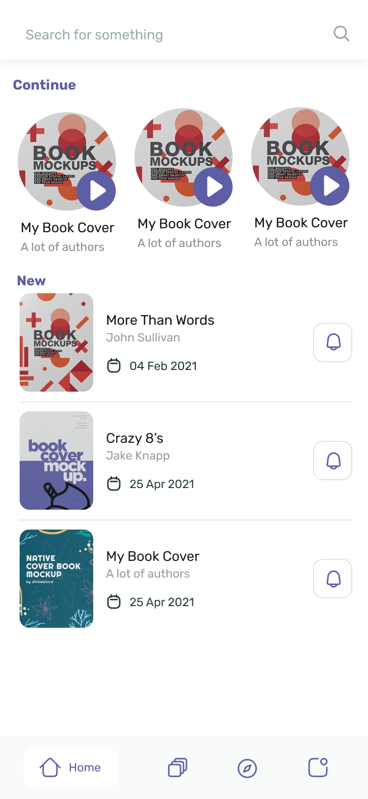
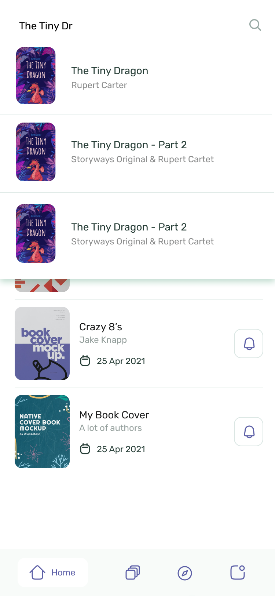

# tapped_test_project

*First of all, it's awesome that you are reading this introduction because that means, that you had your first successful interview. As a next step, we will check your Flutter skills, your knowledge, and how you solve problems.*

## Introduction

In this project, you will find designs from our app [Storyways](https://storyways.app). You can fork this repository, or create a new public repository on [GitHub](https://github.com/) or [GitLab](https://gitlab.com/) where you implement the screens shown in the designs.
To ensure that there is a strong linter, you should use the strong linter [tapped_lints](https://github.com/tappeddev/tapped_lints) that is available on GitHub. The readme of tapped_lints describes how to use the package.  

## Task

The design shows a list of books with a search bar at the top. When you start searching the overlay expands and shows the results. The data is mocked for now and you can use [picsum](https://picsum.photos/) for finding example photos for book covers.

Following features should be included:
- [ ] Setup and use [FVM](https://fvm.app/)
- [ ] [tapped_lints](https://github.com/tappeddev/tapped_lints) is included 
- [ ] Create a list with a few book items that can be used for the different sections and the search
- [ ] "Continue" and "New" sections are in one list that is scrollable vertically
- [ ] "Continue" section can scroll horizontally
- [ ] The `ListView` should build items lazy by using `ListView.builder`
- [ ] Items should have touch feedback, but no navigation
- [ ] When the search results appear, the overlay expands and reveals the items
- [ ] When the user taps outside of the overlay, the overlay closes
- [ ] When the user clears the text, the overlay closes as well
- [ ] Bottom navigation bar does nothing on tap (only visuals)
- [ ] Light & Dark theme is possible and switch automatically when changing the device theme

## Design & Resources

⚠️ Keep in mind that you only download the icons from Figma as svg and not the whole items with border radius or other elements like the bottom navigation bar.

For all details like the font size, the colors, or any needed assets you need to check out the Figma link by yourself.

You can find the full design [here](https://www.figma.com/file/aRxa2vnAQgkenyjo5fwm9e/Untitled?node-id=0%3A1).

> If there are any questions regarding the design, the task, or anything about the next interview steps, please feel free to contact us. You can always contact us at: **contact@tapped.dev**